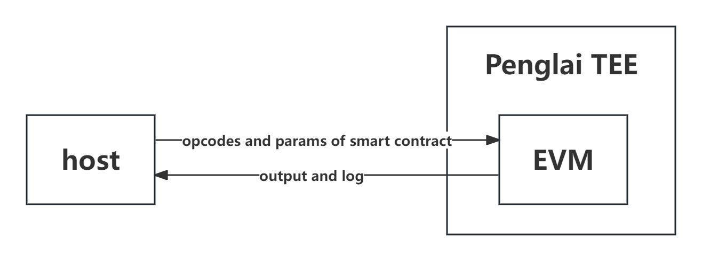
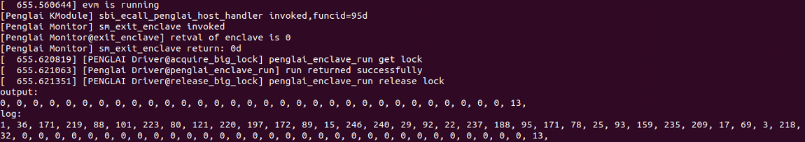

# Penglai-EVM

This demo implements a relatively complete Ethereum Virtual Machine(EVM) in the Penglai system.

## Introduction

- [EVM](https://ethereum.org/en/developers/docs/evm/) is a stack-based virtual machine operating on the blockchain, which can be considered as a standardized computer used to execute smart contracts.
- In this demo, the EVM is migrated to the Penglai system to support bytecode execution within the enclave.
- The main architecture and process of this demo are shown in the figure below. The host needs to pass the opcodes and parameters into TEE, complete the corresponding execution in TEE, and then return the obtained output and log information to the host.
  
  - The opcodes and parameters need to be written in `Solidity` code to get the bytecode, and then converted to the corresponding format by Ethereum client.

## Quick Start

- Compile Penglai sdk demo: `PENGLAI_SDK=$(pwd) make -j8`.
- After successful compilation, corresponding executable files `evm` and `evm_host` will be generated in the `sdk/demo/evm` and `sdk/demo/evm/host` directories respectively.
- Copy the two generated executable files to openEuler Qemu.
- Execute `./evm_host evm` after executing `insmod penglai.ko`.
- After correct execution, you will get the output as shown below.
  
  - The smart contract code used in this demo is to calculate the Fibonacci number, and the parameter passed in is 7, so the output obtained is the seventh Fibonacci number, which is 13.

## Project file introduction

- `host` directory: Place the corresponding host file. In the host file, the bytecode and parameters that need to be executed will be passed to the enclave.
- `include` directory: Place header files used by the project.
- `lib` directory: Place the static libraries needed to import C++.
- `src` directory: 
  - `uint256` directory: Implement the uint256 type that needs to be used in the project.
  - `evm_entry.c`: Entry file of enclave.
  - `evm_main.cpp`: Complete the system initialization and create the corresponding processor to execute the bytecode.
  - `process.cpp`: The core part, executing bytecode, will execute corresponding logic according to different instructions.
  - `stack.cpp`: The stack structure used in EVM.
  - `stub.cpp`: Some stub functions involved in the static library.
  - `util.cpp`: Provide some basic methods, such as data type conversion, encryption and decryption, etc.
